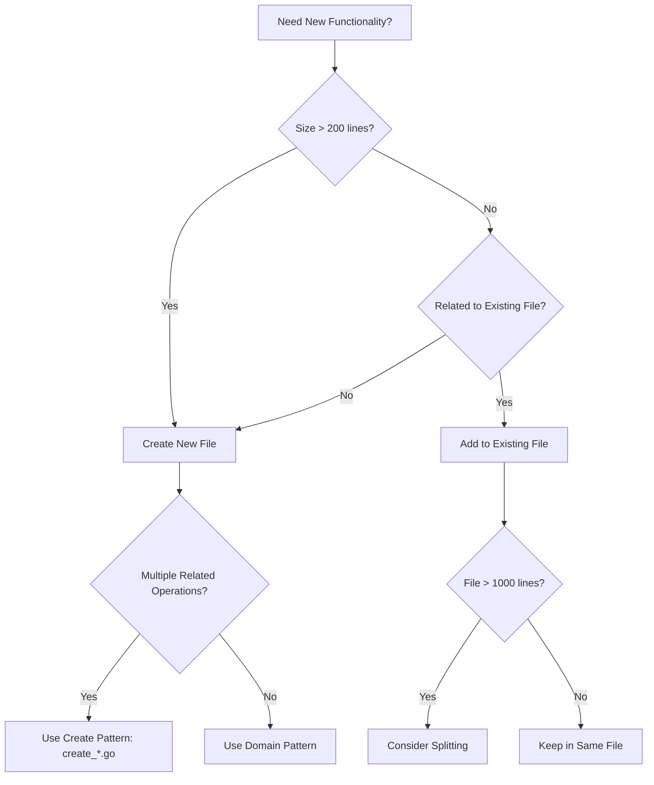
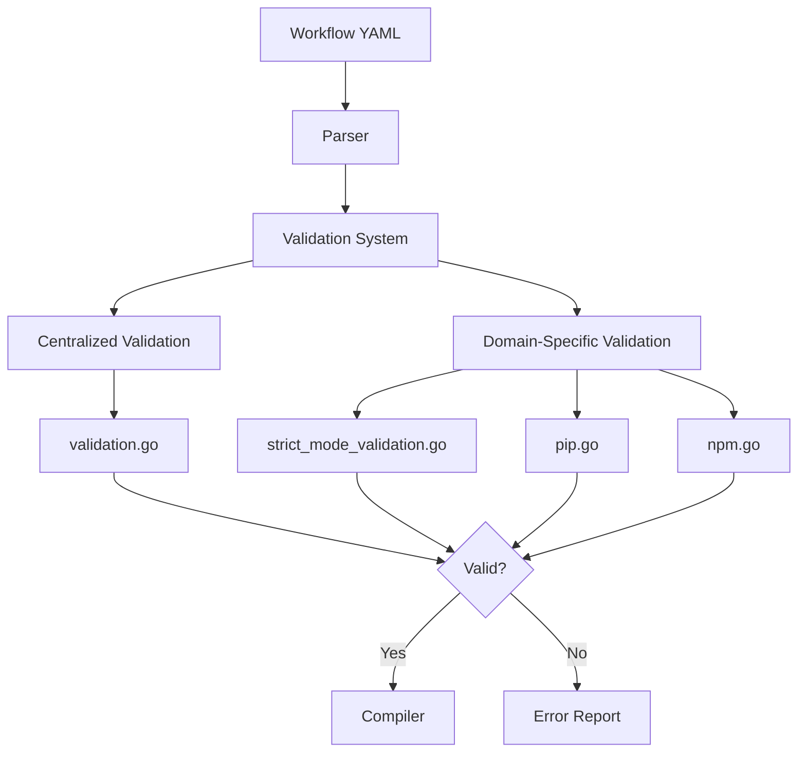
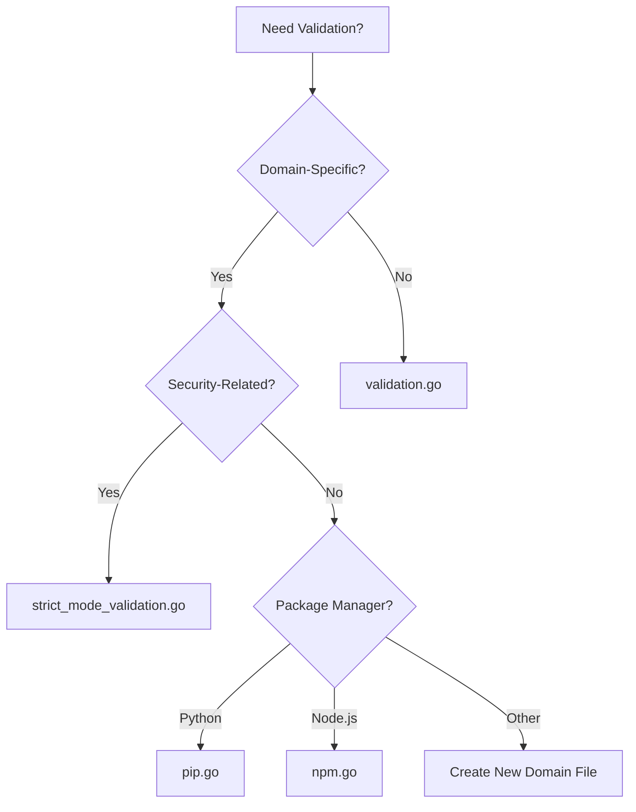
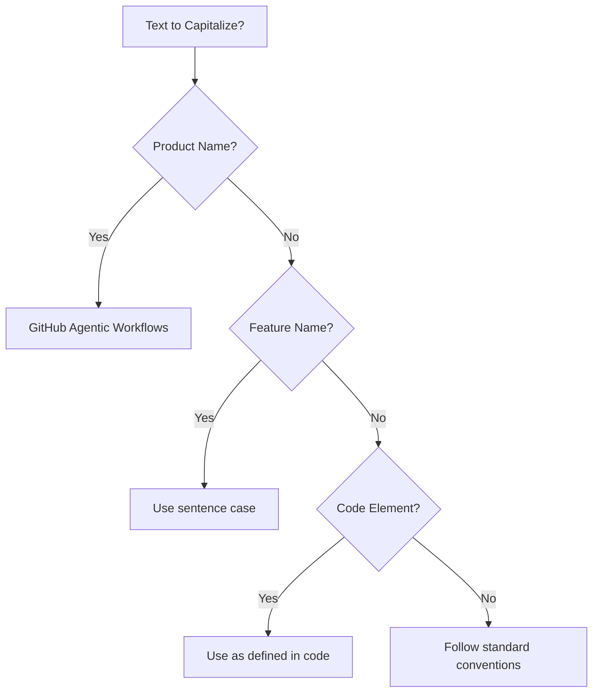
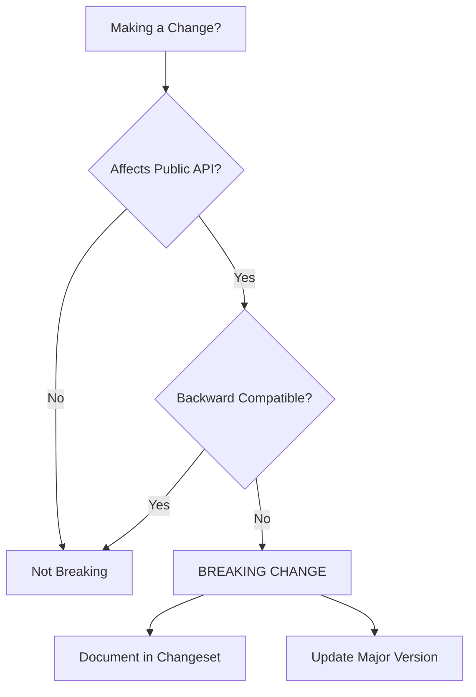
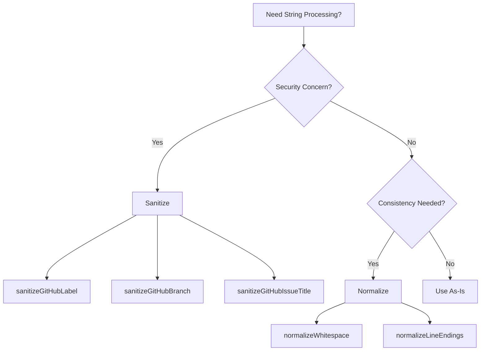
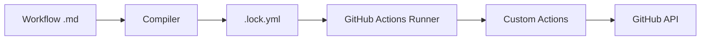
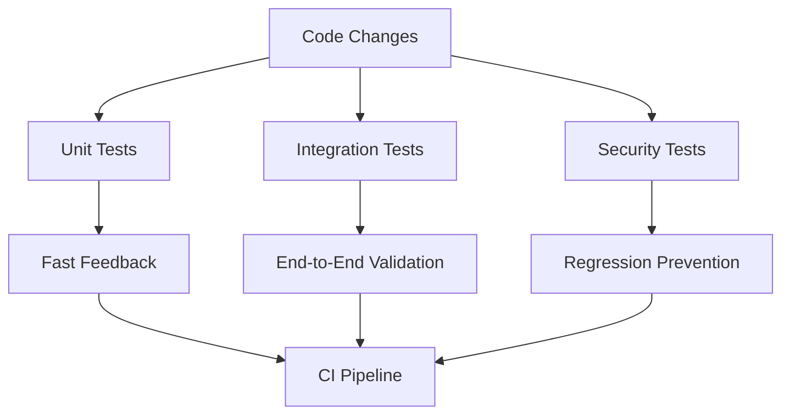
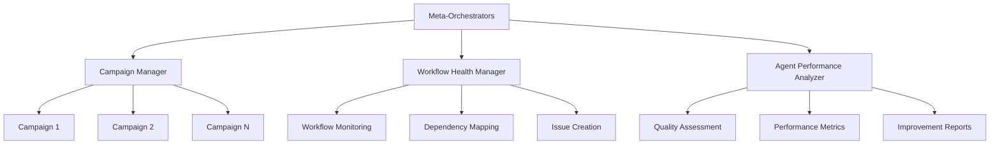

# Developer Instructions

This document consolidates development guidelines, architectural patterns, and implementation standards for GitHub Agentic Workflows. It provides comprehensive guidance for contributing to the codebase while maintaining consistency, security, and code quality.

## Table of Contents

- [Response Structure Guidelines](#response-structure-guidelines)
- [Code Organization Patterns](#code-organization-patterns)
- [Validation Architecture](#validation-architecture)
- [Development Standards](#development-standards)
- [String Processing](#string-processing)
- [YAML Handling](#yaml-handling)
- [Safe Output Messages](#safe-output-messages)
- [Custom GitHub Actions](#custom-github-actions)
- [Security Best Practices](#security-best-practices)
- [Testing Framework](#testing-framework)
- [Repo-Memory System](#repo-memory-system)
- [Hierarchical Agent Management](#hierarchical-agent-management)
- [Release Management](#release-management)
- [Quick Reference](#quick-reference)

---

## Response Structure Guidelines

When creating workflows or responding to workflow creation requests, follow this proven 7-part communication structure that enhances learning, consistency, and user satisfaction. This structure was identified through agent persona exploration research and has shown consistent success across diverse automation scenarios.

### The 7-Part Structure

#### 1. Success Announcement with Emoji

**Purpose**: Immediately communicate successful completion and set a positive tone

**Format**: 
```markdown
🎉 Successfully created [workflow/feature name]!
```

**Emoji Usage Patterns**:
- 🎉 - General success, workflow creation complete
- 🚀 - Deployment, launch, or production-ready features
- ✨ - New features, enhancements, or improvements
- ✅ - Validation, testing, or quality assurance complete
- 🔧 - Configuration, setup, or technical work
- 📊 - Analysis, reports, or metrics
- 🛡️ - Security, safety, or reliability improvements

**Examples**:
```markdown
🎉 Successfully created your PR review automation workflow!
🚀 Deployment monitoring workflow is ready to launch!
✨ Enhanced your test coverage analyzer with new features!
```

#### 2. Deliverables Summary

**Purpose**: Provide a clear inventory of what was created

**Format**:
```markdown
## What Was Created

- `filename.md` (XXX lines) - Brief description
- `another-file.lock.yml` (XXX lines) - Auto-generated workflow
```

**Best Practices**:
- Include file sizes (line counts) for transparency
- Add brief descriptions explaining each file's purpose
- List files in logical order (source files before generated files)
- Use relative paths from repository root

**Example**:
```markdown
## What Was Created

- `.github/workflows/pr-schema-reviewer.md` (145 lines) - Main workflow that reviews database schema changes
- `.github/workflows/pr-schema-reviewer.lock.yml` (342 lines) - Compiled GitHub Actions workflow
- `docs/workflows/schema-review-guide.md` (78 lines) - Documentation for customization
```

#### 3. Quick Start Commands

**Purpose**: Enable immediate testing and usage with zero friction

**Format**: Copy-paste ready commands in code blocks with clear descriptions

**Best Practices**:
- Always use code blocks (triple backticks)
- Include commands for compilation, testing, and execution
- Add brief explanations before each command block
- Test commands work exactly as written
- 100% of successful workflows include copy-paste ready commands

**Example**:
```markdown
## Quick Start

Compile the workflow:
\`\`\`bash
gh aw compile .github/workflows/pr-schema-reviewer.md
\`\`\`

Test it manually:
\`\`\`bash
gh aw run pr-schema-reviewer --pr 123
\`\`\`

View the compiled output:
\`\`\`bash
cat .github/workflows/pr-schema-reviewer.lock.yml
\`\`\`
```

#### 4. Key Features

**Purpose**: Highlight capabilities and value proposition

**Format**: Bulleted list with checkmarks

**Best Practices**:
- Use ✅ or - [ ] for checkmarks depending on completion status
- Focus on user-facing benefits, not implementation details
- List 4-7 key features (not too many, not too few)
- Start each item with an action verb or capability statement

**Example**:
```markdown
## Key Features

✅ Automatically triggered on database schema PR changes
✅ Validates migration safety (no destructive operations)
✅ Checks for proper indexing on new columns
✅ Verifies backward compatibility
✅ Comments detailed analysis directly on PR
✅ Suggests improvements with code examples
```

#### 5. Customization Options

**Purpose**: Empower users to adapt the workflow to their needs

**Format**: Section with subsections for different customization areas

**Best Practices**:
- Focus on common customization scenarios
- Provide concrete examples with before/after code
- Include framework-specific or context-specific options
- Link to relevant documentation when available
- Make modifications feel approachable, not overwhelming

**Example**:
```markdown
## Customization Options

### Adjust Trigger Conditions
Change which files trigger the workflow:
\`\`\`yaml
# Current: All .sql files
paths:
  - '**/*.sql'

# Option: Only migration files
paths:
  - 'db/migrations/**/*.sql'
\`\`\`

### Configure Analysis Depth
Adjust the thoroughness of schema analysis:
\`\`\`yaml
# In frontmatter, add:
env:
  ANALYSIS_LEVEL: strict  # Options: basic, standard, strict
\`\`\`

### Add Custom Reviewers
Automatically request reviews from database experts:
\`\`\`yaml
safe-outputs:
  add_comment:
    body: |
      cc @database-team for schema review
\`\`\`
```

#### 6. Pro Tips

**Purpose**: Share best practices and insider knowledge

**Format**: Numbered or bulleted list of actionable advice

**Best Practices**:
- Include 3-5 tips (quality over quantity)
- Focus on non-obvious insights
- Address common pitfalls or gotchas
- Provide context for why the tip matters
- Use conversational, helpful tone

**Example**:
```markdown
## Pro Tips

💡 **Test with a draft PR first**: Create a draft PR with a small schema change to verify the workflow behavior before using it on real changes.

💡 **Use descriptive migration names**: Name your migration files with timestamps and descriptions (e.g., `20240115_add_user_preferences_table.sql`) to help the analysis provide better context.

💡 **Enable discussion mode**: Set `permissions.pull-requests: write` to allow the workflow to create discussion threads rather than simple comments.

💡 **Monitor execution time**: Schema analysis can take 2-5 minutes for large changes. Consider adding a `timeout-minutes: 10` setting to prevent hanging.
```

#### 7. Next Steps

**Purpose**: Guide users on what to do after initial setup

**Format**: Ordered list of logical progression steps

**Best Practices**:
- Start with immediate actions (testing)
- Progress to deployment/production use
- Include optional enhancement steps
- End with links to documentation or support
- Keep to 3-5 steps maximum

**Example**:
```markdown
## Next Steps

1. **Test the workflow**: Create a test PR with a small schema change to verify everything works
2. **Review the first analysis**: Check the quality and accuracy of the automated review
3. **Customize for your database**: Adjust rules based on your specific database (PostgreSQL, MySQL, etc.)
4. **Enable for all schema PRs**: Once confident, enable required status checks in branch protection
5. **Explore advanced features**: Check out [Schema Review Best Practices](docs/schema-review.md) for advanced configurations

Need help? Open a discussion in the [Agentic Workflows community](https://github.com/githubnext/gh-aw/discussions).
```

### Complete Template Example

Here's how all 7 parts flow together:

```markdown
🎉 Successfully created your PR schema review automation workflow!

## What Was Created

- `.github/workflows/pr-schema-reviewer.md` (145 lines) - Main workflow that reviews database schema changes
- `.github/workflows/pr-schema-reviewer.lock.yml` (342 lines) - Compiled GitHub Actions workflow

## Quick Start

Compile the workflow:
\`\`\`bash
gh aw compile .github/workflows/pr-schema-reviewer.md
\`\`\`

Test it manually:
\`\`\`bash
gh aw run pr-schema-reviewer --pr 123
\`\`\`

## Key Features

✅ Automatically triggered on database schema PR changes
✅ Validates migration safety (no destructive operations)
✅ Checks for proper indexing on new columns
✅ Verifies backward compatibility
✅ Comments detailed analysis directly on PR

## Customization Options

### Adjust Trigger Conditions
\`\`\`yaml
paths:
  - 'db/migrations/**/*.sql'  # Only migration files
\`\`\`

### Configure Analysis Depth
\`\`\`yaml
env:
  ANALYSIS_LEVEL: strict  # Options: basic, standard, strict
\`\`\`

## Pro Tips

💡 **Test with a draft PR first**: Create a draft PR with a small schema change to verify the workflow behavior.

💡 **Use descriptive migration names**: Helps the analysis provide better context.

💡 **Monitor execution time**: Schema analysis can take 2-5 minutes for large changes.

## Next Steps

1. **Test the workflow**: Create a test PR with a small schema change
2. **Review the first analysis**: Check the quality and accuracy
3. **Customize for your database**: Adjust rules for PostgreSQL, MySQL, etc.
4. **Enable required status checks**: Add to branch protection once confident
```

### Real-World Examples

The following examples demonstrate the 7-part structure in action, adapted from high-scoring workflow responses in agent persona exploration research:

#### Example 1: Frontend Developer - Visual Regression Testing (Score: 4.8/5.0)

```markdown
✨ Successfully created your visual regression testing workflow!

## What Was Created

- `.github/workflows/visual-regression-test.md` (167 lines) - Automated visual testing on component changes
- `.github/workflows/visual-regression-test.lock.yml` (389 lines) - Compiled GitHub Actions workflow
- `docs/visual-testing-guide.md` (92 lines) - Setup and customization guide

## Quick Start

Compile and test the workflow:
\`\`\`bash
# Compile the workflow
gh aw compile .github/workflows/visual-regression-test.md

# Test with a PR that has component changes
gh aw run visual-regression-test --pr 456

# View the generated report
open artifacts/visual-regression-report.html
\`\`\`

## Key Features

✅ Automatically captures screenshots of changed components
✅ Compares against baseline images from main branch
✅ Generates visual diff reports with pixel-perfect comparison
✅ Posts summary directly on PR with image previews
✅ Supports multiple browsers (Chrome, Firefox, Safari)
✅ Configurable viewport sizes for responsive testing

## Customization Options

### Target Specific Components
\`\`\`yaml
# In frontmatter, specify component paths:
env:
  COMPONENT_PATHS: 'src/components/Button,src/components/Modal'
\`\`\`

### Adjust Diff Sensitivity
\`\`\`yaml
env:
  DIFF_THRESHOLD: 0.1  # 0.0 (exact) to 1.0 (ignore all differences)
\`\`\`

### Configure Viewports
\`\`\`yaml
env:
  VIEWPORTS: 'mobile:375x667,tablet:768x1024,desktop:1920x1080'
\`\`\`

## Pro Tips

💡 **Update baselines carefully**: Run `gh aw run visual-regression-test --update-baseline` only when intentional visual changes are made.

💡 **Test in draft mode first**: Enable `playwright.headed: true` to watch browser automation during initial setup.

💡 **Manage large diffs**: For major redesigns, consider creating a new baseline branch to avoid overwhelming PR reviews.

💡 **Optimize performance**: Use `playwright.parallel: true` to run multiple browser tests simultaneously.

## Next Steps

1. **Generate initial baselines**: Run the workflow on main branch to create reference images
2. **Test with a small change**: Make a minor component update to verify detection works
3. **Review the report format**: Ensure the visual diff format meets your team's needs
4. **Integrate with CI**: Add as required check for component-touching PRs
5. **Explore advanced features**: Check out [Visual Testing Best Practices](docs/visual-testing-guide.md)
```

#### Example 2: DevOps Engineer - Deployment Monitoring (Score: 4.6/5.0)

```markdown
🚀 Successfully created your deployment monitoring and incident automation workflow!

## What Was Created

- `.github/workflows/deployment-monitor.md` (203 lines) - Monitors deployments and creates incidents
- `.github/workflows/deployment-monitor.lock.yml` (456 lines) - Compiled GitHub Actions workflow

## Quick Start

Deploy and monitor:
\`\`\`bash
# Compile the workflow
gh aw compile .github/workflows/deployment-monitor.md

# The workflow automatically triggers on deployment events
# To test manually with a specific deployment:
gh aw run deployment-monitor --deployment-id 123456

# View recent monitoring results:
gh run list --workflow=deployment-monitor.lock.yml
\`\`\`

## Key Features

✅ Automatically monitors all production deployments
✅ Fetches and analyzes deployment logs in real-time
✅ Detects common failure patterns (OOM, timeouts, config errors)
✅ Creates incident issues with root cause analysis
✅ Includes relevant log excerpts and stack traces
✅ Tags appropriate teams based on error type
✅ Integrates with PagerDuty for critical failures

## Customization Options

### Configure Monitoring Duration
\`\`\`yaml
env:
  MONITOR_DURATION: 300  # Seconds to monitor post-deployment (default: 300)
\`\`\`

### Set Failure Detection Patterns
\`\`\`yaml
# Add custom error patterns in prompt:
"Watch for these critical patterns:
- Database connection failures
- Memory leaks (heap > 90%)
- API gateway 5xx errors"
\`\`\`

### Customize Incident Routing
\`\`\`yaml
safe-outputs:
  create_issue:
    labels: ["incident", "production", "{{ error_type }}"]
    assignees: ["@oncall-engineer"]
\`\`\`

### Integrate External Services
\`\`\`yaml
tools:
  web-fetch:
    allowed-domains: ["api.pagerduty.com", "hooks.slack.com"]
\`\`\`

## Pro Tips

💡 **Set up log aggregation**: Ensure your deployment platform exposes logs via API for effective monitoring.

💡 **Fine-tune detection thresholds**: Start with conservative settings and adjust based on false positive rates.

💡 **Test with staging deploys first**: Use staging deployments to validate the workflow before production.

💡 **Configure notification preferences**: Use GitHub Actions notifications to alert the team about new incidents immediately.

💡 **Archive resolved incidents**: Create automation to close incident issues when deployments succeed after fixes.

## Next Steps

1. **Test with a staging deployment**: Verify monitoring works correctly in a non-production environment
2. **Configure team notifications**: Set up Slack/email alerts for critical incidents
3. **Establish runbook links**: Add links to relevant runbooks in incident templates
4. **Enable auto-rollback**: Integrate with deployment tools to trigger automatic rollbacks on critical failures
5. **Review incident history**: After a week, analyze patterns to improve detection rules
```

#### Example 3: QA Tester - Test Coverage Analysis (Score: 4.7/5.0)

```markdown
✅ Successfully created your automated test coverage analysis workflow!

## What Was Created

- `.github/workflows/test-coverage-analyzer.md` (134 lines) - Analyzes test coverage changes in PRs
- `.github/workflows/test-coverage-analyzer.lock.yml` (298 lines) - Compiled GitHub Actions workflow

## Quick Start

Enable coverage analysis:
\`\`\`bash
# Compile the workflow
gh aw compile .github/workflows/test-coverage-analyzer.md

# The workflow runs automatically on PRs
# To test manually:
gh aw run test-coverage-analyzer --pr 789

# View coverage report:
gh pr view 789 --comments
\`\`\`

## Key Features

✅ Calculates coverage delta between PR and main branch
✅ Identifies uncovered lines in new/modified code
✅ Generates coverage report with visual indicators
✅ Comments recommendations directly on PR
✅ Highlights critical paths that need test coverage
✅ Supports multiple test frameworks (Jest, pytest, Go test)

## Customization Options

### Set Coverage Thresholds
\`\`\`yaml
env:
  MIN_COVERAGE_CHANGE: -2  # Fail if coverage drops by more than 2%
  TARGET_COVERAGE: 80      # Overall target percentage
\`\`\`

### Configure Framework
\`\`\`yaml
# Specify your test framework in frontmatter:
runtimes:
  node:
    version: "20"
    packages:
      - "jest"
      - "@jest/coverage"
\`\`\`

### Customize Report Format
\`\`\`yaml
env:
  REPORT_FORMAT: detailed  # Options: summary, detailed, critical-only
\`\`\`

## Pro Tips

💡 **Require coverage on new code only**: Focus on ensuring new code is well-tested rather than penalizing legacy code.

💡 **Exempt generated files**: Configure `.coveragerc` or `jest.config.js` to exclude auto-generated code from coverage requirements.

💡 **Balance coverage with quality**: 100% coverage doesn't guarantee quality tests. Focus on meaningful test scenarios.

💡 **Use coverage trends**: Track coverage over time to identify areas that need attention.

## Next Steps

1. **Verify coverage tool integration**: Ensure your test runner generates coverage reports correctly
2. **Set appropriate thresholds**: Start lenient and tighten based on team capability
3. **Add coverage badge**: Display coverage percentage in README using shields.io
4. **Review first PR analysis**: Check that recommendations are helpful and accurate
5. **Train team on coverage best practices**: Share guidelines on writing meaningful tests

Need help? Check out [Test Coverage Best Practices](docs/test-coverage-guide.md).
```

### Key Success Factors

Based on analysis of high-scoring workflow responses:

1. **100% adoption of copy-paste ready commands**: Every successful workflow includes immediately executable commands
2. **Clear value proposition**: Key features section makes benefits immediately obvious
3. **Progressive disclosure**: Structure moves from quick wins (Quick Start) to advanced usage (Customization)
4. **Contextual emoji usage**: Emojis enhance readability without being excessive (1-2 per section max)
5. **Actionable pro tips**: Tips address real pain points discovered during testing
6. **Logical next steps**: Progression from testing to production deployment feels natural

### When to Deviate from the Structure

This structure works best for:
- Workflow creation responses
- Feature implementation announcements
- Automation setup guides

Consider adapting or simplifying for:
- Simple bug fixes (may only need parts 1, 2, and 7)
- Documentation updates (may skip parts 3 and 4)
- Quick responses to clarification questions (success announcement and next steps only)

The key is maintaining the spirit of clear communication while adapting to context.

---

## Code Organization Patterns

### Recommended Patterns

The codebase exhibits several well-organized patterns that should be emulated:

#### 1. Create Functions Pattern (`create_*.go`)

**Pattern**: One file per GitHub entity creation operation

**Examples**:
- `create_issue.go` - GitHub issue creation logic
- `create_pull_request.go` - Pull request creation logic
- `create_discussion.go` - Discussion creation logic
- `create_code_scanning_alert.go` - Code scanning alert creation
- `create_agent_task.go` - Agent task creation logic

**Why it works**:
- Clear separation of concerns
- Enables quick location of specific functionality
- Prevents files from becoming too large
- Facilitates parallel development
- Makes testing straightforward

#### 2. Engine Separation Pattern

**Pattern**: Each AI engine has its own file with shared helpers in `engine_helpers.go`

**Examples**:
- `copilot_engine.go` (971 lines) - GitHub Copilot engine
- `claude_engine.go` (340 lines) - Claude engine
- `codex_engine.go` (639 lines) - Codex engine
- `custom_engine.go` (300 lines) - Custom engine support
- `engine_helpers.go` (424 lines) - Shared engine utilities

**Why it works**:
- Engine-specific logic is isolated
- Shared code is centralized
- Allows addition of new engines without affecting existing ones
- Clear boundaries reduce merge conflicts

#### 3. Test Organization Pattern

**Pattern**: Tests live alongside implementation files with descriptive names

**Examples**:
- Feature tests: `feature.go` + `feature_test.go`
- Integration tests: `feature_integration_test.go`
- Specific scenario tests: `feature_scenario_test.go`

**Why it works**:
- Tests are co-located with implementation
- Clear test purpose from filename
- Encourages comprehensive testing
- Separates integration from unit tests

### File Creation Decision Tree



### File Size Guidelines

- **Small (50-200 lines)**: Utilities, helpers, simple features
- **Medium (200-500 lines)**: Domain-specific logic, focused features
- **Large (500-1000 lines)**: Complex features, comprehensive implementations
- **Very Large (1000+ lines)**: Consider splitting if not cohesive

**Implementation**: See specs/code-organization.md for complete guidelines

---

## Validation Architecture

The validation system ensures workflow configurations are correct, secure, and compatible with GitHub Actions before compilation. Validation is organized into two main patterns:

1. **Centralized validation** - General-purpose validation in `validation.go`
2. **Domain-specific validation** - Specialized validation in dedicated files

### Validation Flow



### Centralized Validation: `validation.go`

**Location**: `pkg/workflow/validation.go` (782 lines)

**Purpose**: General-purpose validation that applies across the entire workflow system

**Key Validation Functions**:
- `validateExpressionSizes()` - Ensures GitHub Actions expression size limits
- `validateContainerImages()` - Verifies Docker images exist and are accessible
- `validateRuntimePackages()` - Validates runtime package dependencies
- `validateGitHubActionsSchema()` - Validates against GitHub Actions YAML schema
- `validateNoDuplicateCacheIDs()` - Ensures unique cache identifiers
- `validateSecretReferences()` - Validates secret reference syntax
- `validateRepositoryFeatures()` - Checks repository capabilities (issues, discussions)

### Domain-Specific Validation

#### Strict Mode Validation: `strict_mode_validation.go`

**Purpose**: Enforces security and safety constraints in strict mode

**Validation Functions**:
- `validateStrictMode()` - Main strict mode orchestrator
- `validateStrictPermissions()` - Refuses write permissions
- `validateStrictNetwork()` - Requires explicit network configuration
- `validateStrictMCPNetwork()` - Requires network config on custom MCP servers
- `validateStrictBashTools()` - Refuses bash wildcard tools

#### Package Validation

- **Python/pip**: `pip.go` - Validates Python package availability on PyPI
- **Node.js/npm**: `npm.go` - Validates npm packages used with npx

### Where to Add Validation



**Implementation**: See specs/validation-architecture.md for complete architecture

---

## Development Standards

### Capitalization Guidelines



**Rules**:
- **Product Name**: "GitHub Agentic Workflows" (always capitalize)
- **Feature Names**: Use sentence case (e.g., "safe output messages")
- **File Names**: Use lowercase with hyphens (e.g., `code-organization.md`)
- **Code Elements**: Follow language conventions (e.g., `camelCase` in JavaScript, `snake_case` in Python)

**Implementation**: See specs/capitalization.md and `cmd/gh-aw/capitalization_test.go`

### Breaking Change Rules



**Breaking Changes**:
- Removing or renaming CLI commands, flags, or options
- Changing default behavior that users depend on
- Removing support for configuration formats
- Changing exit codes or error messages that tools parse

**Non-Breaking Changes**:
- Adding new optional flags or commands
- Adding new output formats
- Internal refactoring with same external behavior
- Adding new features that don't affect existing functionality

**Implementation**: See specs/breaking-cli-rules.md for complete rules

---

## String Processing

### Sanitize vs Normalize



**Sanitize**: Remove or replace characters that could cause security issues or break GitHub API constraints

**Key Functions**:
- `sanitizeGitHubLabel()` - Ensures labels meet GitHub requirements (no emoji, length limits)
- `sanitizeGitHubBranch()` - Validates branch names against Git ref rules
- `sanitizeGitHubIssueTitle()` - Ensures issue titles don't contain problematic characters

**Normalize**: Standardize format for consistency without security implications

**Key Functions**:
- `normalizeWhitespace()` - Standardizes whitespace (spaces, tabs, newlines)
- `normalizeLineEndings()` - Converts CRLF to LF
- `normalizeMarkdown()` - Standardizes markdown formatting

**Implementation**: See specs/string-sanitization-normalization.md and `pkg/workflow/strings.go`

---

## YAML Handling

### YAML 1.1 vs 1.2 Gotchas

**Critical Issue**: GitHub Actions uses YAML 1.1, but many Go YAML libraries default to YAML 1.2

**Key Differences**:
- `on` keyword: YAML 1.1 treats as boolean `true`, YAML 1.2 treats as string
- `yes`/`no`: YAML 1.1 treats as booleans, YAML 1.2 treats as strings
- Octal numbers: Different parsing rules

**Solution**: Use `goccy/go-yaml` library which supports YAML 1.1

```go
import "github.com/goccy/go-yaml"

// Correct YAML 1.1 parsing
var workflow map[string]interface{}
err := yaml.Unmarshal(data, &workflow)
```

**Affected Keywords**:
- Workflow triggers: `on`, `push`, `pull_request`
- Boolean values: `yes`, `no`, `true`, `false`, `on`, `off`
- Null values: `null`, `~`

**Implementation**: See specs/yaml-version-gotchas.md and `pkg/workflow/compiler.go`

---

## Safe Output Messages

The safe output message system provides structured communication between AI agents and GitHub API operations.

### Message Categories

| Category | Purpose | Footer | Example |
|----------|---------|--------|---------|
| **Issues** | Create/update issues | With issue number | `> AI generated by [Workflow](url) for #123` |
| **Pull Requests** | Create/update PRs | With PR number | `> AI generated by [Workflow](url) for #456` |
| **Discussions** | Create discussions | With discussion number | `> AI generated by [Workflow](url)` |
| **Comments** | Add comments | Context-aware | `> AI generated by [Workflow](url) for #123` |

### Staged Mode Indicator

The 🎭 emoji consistently marks preview mode across all safe output types, enabling clear distinction between test runs and live operations.

### Message Structure

```yaml
safe_outputs:
  create_issue:
    title: "Issue title"
    body: |
      ## Description

      Content here

      ---
      > AI generated by [WorkflowName](run_url)
```

**Implementation**: See specs/safe-output-messages.md and `pkg/workflow/safe_outputs.go`

---

## Custom GitHub Actions

### Architecture



### Build System

The custom actions build system is **entirely implemented in Go** in `pkg/cli/actions_build_command.go`. There are no JavaScript build scripts.

**Key Commands**:
- `make actions-build` - Build all custom actions
- `make actions-validate` - Validate action configuration
- `make actions-clean` - Clean build artifacts

**Directory Structure**:
```
actions/
└── setup/
    ├── action.yml
    ├── setup.sh
    ├── js/
    └── sh/
```

**Implementation**: See specs/actions.md and `pkg/cli/actions_build_command.go`

---

## Security Best Practices

### Template Injection Prevention

**Key Rule**: Never directly interpolate user input into GitHub Actions expressions or shell commands

**Vulnerable Pattern**:
```yaml
# ❌ UNSAFE - User input in expression
- run: echo "Title: ${{ github.event.issue.title }}"
```

**Safe Pattern**:
```yaml
# ✅ SAFE - Use environment variables
- env:
    TITLE: ${{ github.event.issue.title }}
  run: echo "Title: ${TITLE}"
```

### GitHub Actions Security

**Best Practices**:
- Always pin actions to specific commit SHAs, not tags
- Use minimal permissions with `permissions:` block
- Validate all external inputs
- Never log secrets or tokens
- Use GitHub's OIDC for cloud authentication

**Example**:
```yaml
permissions:
  contents: read
  issues: write
  pull-requests: write

steps:
  - uses: actions/checkout@a1b2c3d4... # Pinned SHA
```

**Implementation**: See specs/github-actions-security-best-practices.md and specs/template-injection-prevention.md

---

## Testing Framework

### Test Strategy



### Test Types

| Test Type | Purpose | Location | Run Frequency |
|-----------|---------|----------|---------------|
| **Unit Tests** | Test individual functions | `*_test.go` | Every commit |
| **Integration Tests** | Test component interactions | `*_integration_test.go` | Pre-merge |
| **Security Regression Tests** | Prevent security issues | `security_regression_test.go` | Every commit |
| **Fuzz Tests** | Find edge cases | `*_fuzz_test.go` | Continuous |
| **Benchmark Tests** | Performance tracking | `*_benchmark_test.go` | Pre-release |

### Test Maintenance

The testing framework is designed to be:
- **Self-validating**: The validation script ensures all tests work correctly
- **Comprehensive**: Covers all aspects of functionality and interface design
- **Maintainable**: Clear structure and documentation for future updates
- **Scalable**: Tests can be added incrementally as functionality is implemented
- **Security-focused**: Security regression tests prevent reintroduction of vulnerabilities

### Visual Regression Testing

Visual regression tests ensure console output formatting remains consistent across code changes. The system uses golden files to capture expected output for table layouts, box rendering, tree structures, and error formatting.

**Golden Test Commands**:
```bash
# Run golden tests
go test -v ./pkg/console -run='^TestGolden_'

# Update golden files (only when intentionally changing output)
make update-golden
```

**Test Coverage**:
- Table rendering with various configurations
- Box formatting with different widths and content
- Tree structures for hierarchical data
- Error messages with context and suggestions
- Message formatting (success, info, warning, error)
- Layout composition and emphasis boxes

**When to Update Golden Files**:
- ✅ Intentionally improving console output formatting
- ✅ Fixing visual bugs in rendering
- ✅ Adding new columns or fields to tables
- ❌ Tests fail unexpectedly during development
- ❌ Making unrelated code changes

**Implementation**: See specs/visual-regression-testing.md and `pkg/console/golden_test.go`

---

## Repo-Memory System

The repo-memory feature provides persistent, git-backed storage for AI agents across workflow runs. Agents can maintain state, notes, and artifacts in dedicated git branches with automatic synchronization.

### Architecture Overview

```mermaid
graph TD
    A[Agent Job Start] --> B[Clone memory/{id} branch]
    B --> C[Agent reads/writes files]
    C --> D[Upload artifact: repo-memory-{id}]
    D --> E[Push Repo Memory Job]
    E --> F[Download artifact]
    F --> G[Validate files]
    G --> H[Commit to memory/{id}]
    H --> I[Push to repository]
```

### Path Conventions

| Pattern | Format | Example | Purpose |
|---------|--------|---------|---------|
| **Memory Directory** | `/tmp/gh-aw/repo-memory/{id}` | `/tmp/gh-aw/repo-memory/default` | Runtime directory for agent |
| **Artifact Name** | `repo-memory-{id}` | `repo-memory-default` | GitHub Actions artifact |
| **Branch Name** | `memory/{id}` | `memory/default` | Git branch for storage |

### Data Flow

1. **Clone Phase**: Clones `memory/{id}` branch to local directory
2. **Execution Phase**: Agent reads/writes files in memory directory
3. **Upload Phase**: Uploads directory as GitHub Actions artifact
4. **Download Phase**: Downloads artifact and validates constraints
5. **Push Phase**: Commits files to `memory/{id}` branch and pushes

### Key Configuration

```yaml
repo-memory:
  - id: default
    create-orphan: true
    allow-artifacts: true

  - id: campaigns
    create-orphan: true
    max-file-size: 1MB
    max-files: 100
```

**Validation Constraints**:
- Maximum file size limits
- Maximum file count limits
- Allowed/blocked file patterns
- Size and count tracking in commit messages

**Implementation**: See specs/repo-memory.md and `pkg/workflow/repo_memory.go`

---

## Hierarchical Agent Management

The hierarchical agent system provides meta-orchestration capabilities to manage multiple agents and workflows at scale. Specialized meta-orchestrator workflows oversee, coordinate, and optimize the agent ecosystem.

### Meta-Orchestrator Architecture



### Meta-Orchestrator Roles

| Role | File | Purpose | Schedule |
|------|------|---------|----------|
| **Workflow Health Manager** | `workflow-health-manager.md` | Monitor workflow health | Daily |
| **Agent Performance Analyzer** | `agent-performance-analyzer.md` | Analyze agent quality | Daily |

**Key Capabilities**:
- Cross-campaign coordination
- Workflow health monitoring
- Performance trend analysis
- Strategic priority management
- Proactive maintenance
- Quality assessment

**Implementation**: See specs/agents/hierarchical-agents.md and `.github/workflows/` meta-orchestrator files

---

## Release Management

### Changesets

Use changesets to document changes and manage versioning:

```bash
# Create a changeset
npx changeset

# Release new version
npx changeset version
npx changeset publish
```

**Changeset Format**:
```markdown
---
"gh-aw": patch
---

Brief description of the change
```

**Version Types**:
- **major**: Breaking changes
- **minor**: New features (backward compatible)
- **patch**: Bug fixes and minor improvements

### End-to-End Feature Testing

For manual feature testing in pull requests:

1. Use `.github/workflows/dev.md` as test workflow
2. Add test scenarios as comments in PR
3. Dev Hawk will analyze and verify behavior
4. Do not merge dev.md changes - it remains a reusable test harness

**Implementation**: See specs/changesets.md and specs/end-to-end-feature-testing.md

---

## Quick Reference

### File Locations

| Feature | Implementation File | Test File |
|---------|-------------------|-----------|
| Validation | `pkg/workflow/validation.go` | `pkg/workflow/validation_test.go` |
| Safe Outputs | `pkg/workflow/safe_outputs.go` | `pkg/workflow/safe_outputs_test.go` |
| String Processing | `pkg/workflow/strings.go` | `pkg/workflow/strings_test.go` |
| Actions Build | `pkg/cli/actions_build_command.go` | `pkg/cli/actions_build_command_test.go` |
| Schema Validation | `pkg/parser/schemas/` | Various test files |

### Common Patterns

**Creating a new GitHub entity handler**:
1. Create `create_<entity>.go` in `pkg/workflow/`
2. Implement `Create<Entity>()` function
3. Add validation in `validation.go` or domain-specific file
4. Create corresponding test file
5. Update safe output messages

**Adding new validation**:
1. Determine if centralized or domain-specific
2. Add validation function in appropriate file
3. Call from main validation orchestrator
4. Add tests for valid and invalid cases
5. Document validation rules

**Adding new engine**:
1. Create `<engine>_engine.go` in `pkg/workflow/`
2. Implement engine interface
3. Use `engine_helpers.go` for shared functionality
4. Add engine-specific tests
5. Register engine in engine factory

---

## Additional Documentation

For detailed specifications, see individual files in `specs/`:

### Architecture & Organization
- [Code Organization Patterns](../../specs/code-organization.md)
- [Validation Architecture](../../specs/validation-architecture.md)
- [Layout System](../../specs/layout.md)
- [Go Type Patterns](../../specs/go-type-patterns.md)

### Core Features
- [Safe Output Messages Design](../../specs/safe-output-messages.md)
- [Repo-Memory System](../../specs/repo-memory.md)
- [MCP Gateway](../../specs/mcp-gateway.md)
- [MCP Logs Guardrails](../../specs/mcp_logs_guardrails.md)
- [Custom Actions Build](../../specs/actions.md)

### Testing & Quality
- [Testing Framework](../../specs/testing.md)
- [Visual Regression Testing](../../specs/visual-regression-testing.md)
- [End-to-End Feature Testing](../../specs/end-to-end-feature-testing.md)
- [Security Review](../../specs/security_review.md)
- [GoSec Integration](../../specs/gosec.md)

### Security & Standards
- [GitHub Actions Security](../../specs/github-actions-security-best-practices.md)
- [Template Injection Prevention](../../specs/template-injection-prevention.md)
- [String Sanitization](../../specs/string-sanitization-normalization.md)
- [Schema Validation](../../specs/schema-validation.md)

### Development Guidelines
- [Capitalization Guidelines](../../specs/capitalization.md)
- [Breaking Change Rules](../../specs/breaking-cli-rules.md)
- [CLI Command Patterns](../../specs/cli-command-patterns.md)
- [Styles Guide](../../specs/styles-guide.md)
- [Changesets](../../specs/changesets.md)
- [Labels](../../specs/labels.md)

### Advanced Topics
- [Hierarchical Agents](../../specs/agents/hierarchical-agents.md)
- [Hierarchical Agents Quickstart](../../specs/agents/hierarchical-agents-quickstart.md)
- [Gastown Multi-Agent Orchestration](../../specs/gastown.md)
- [mdflow Comparison](../../specs/mdflow-comparison.md)
- [mdflow Deep Research](../../specs/mdflow.md)

### Technical Details
- [YAML Version Gotchas](../../specs/yaml-version-gotchas.md)
- [Validation Refactoring](../../specs/validation-refactoring.md)
- [Workflow Refactoring Patterns](../../specs/workflow-refactoring-patterns.md)
- [Safe Output Handlers Refactoring](../../specs/safe-output-handlers-refactoring.md)
- [Artifact Naming Compatibility](../../specs/artifact-naming-compatibility.md)
- [Safe Output Environment Variables](../../specs/safe-output-environment-variables.md)

---

**Last Updated**: 2026-01-29
