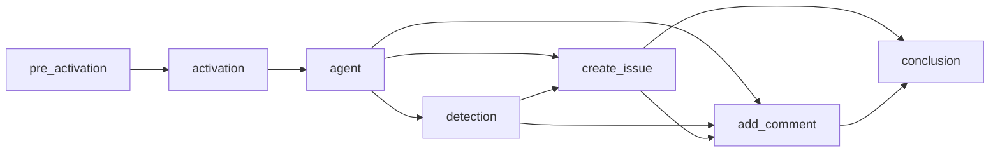

This guide documents the internal compilation process that transforms markdown workflow files into executable GitHub Actions YAML. Understanding this process helps when debugging workflows, optimizing performance, or contributing to the project.

## Overview

The `gh aw compile` command transforms a markdown file with YAML frontmatter into a complete GitHub Actions workflow with multiple orchestrated jobs. This process involves:

1. **Parsing** - Extract frontmatter and markdown content
2. **Validation** - Verify configuration against JSON schemas
3. **Job Building** - Create specialized jobs for different workflow stages
4. **Dependency Management** - Establish job execution order
5. **YAML Generation** - Output final `.lock.yml` file

## Compilation Phases

### Phase 1: Parsing and Validation

The compilation process reads the markdown file and:

- Extracts YAML frontmatter
- Parses workflow configuration
- Validates against the workflow schema
- **Resolves imports** using breadth-first search (BFS) traversal
- **Merges configurations** from imported files according to field-specific rules
- Validates expression safety (only allowed GitHub Actions expressions)

#### Import Resolution Algorithm

Import processing follows a deterministic BFS algorithm:

1. **Queue initialization**: Parse main workflow's `imports:` field and add entries to queue
2. **Iterative processing**: For each import in queue:
   - Resolve path (local file or remote repository reference)
   - Load and parse import file
   - Extract mergeable configurations (tools, mcp-servers, network, etc.)
   - Add import's own imports to end of queue (nested imports)
   - Track visited files to detect circular imports
3. **Configuration accumulation**: Collect all configurations by field type
4. **Merge execution**: Apply field-specific merge strategies
5. **Validation**: Check for conflicts and permission requirements

**Merge strategies**:
- **Tools**: Deep merge with array concatenation and deduplication
- **MCP servers**: Imported servers override main workflow servers with same name
- **Network**: Union of allowed domains, deduplicated and sorted
- **Permissions**: Validation only - main must satisfy imported requirements
- **Safe outputs**: Main workflow overrides imported configurations per type
- **Runtimes**: Main workflow versions override imported versions

**Example processing order**:
```
Main Workflow
├── import-a.md          → Processed 1st
│   ├── nested-1.md      → Processed 3rd (after import-b)
│   └── nested-2.md      → Processed 4th
└── import-b.md          → Processed 2nd
    └── nested-3.md      → Processed 5th
```

See [Imports Reference](/gh-aw/reference/imports/) for complete merge semantics.

### Phase 2: Job Construction

The compilation process builds multiple specialized jobs:

- Pre-activation job (if needed)
- Activation job
- Main agent job
- Safe output jobs
- Safe-jobs
- Custom jobs

### Phase 3: Dependency Resolution

The compilation process validates and orders jobs:

- Checks all job dependencies exist
- Detects circular dependencies
- Computes topological execution order
- Generates Mermaid dependency graph

### Phase 4: Action Pinning

All GitHub Actions are pinned to commit SHAs for security:

1. Check action cache for cached resolution
2. Try dynamic resolution via GitHub API
3. Fall back to embedded action pins data
4. Add version comment (e.g., `actions/checkout@sha # v4`)

### Phase 5: YAML Generation

The compilation process assembles the final workflow:

- Renders workflow header with metadata comments
- Includes job dependency Mermaid graph
- Generates jobs in alphabetical order
- Embeds original prompt as comment
- Writes `.lock.yml` file

## Job Types

The compilation process generates specialized jobs based on workflow configuration:

| Job | Trigger | Purpose | Key Dependencies |
|-----|---------|---------|------------------|
| **pre_activation** | Role checks, stop-after deadlines, skip-if-match, or command triggers | Validates permissions, deadlines, and conditions before AI execution | None (runs first) |
| **activation** | Always | Prepares workflow context, sanitizes event text, validates lock file freshness | `pre_activation` (if exists) |
| **agent** | Always | Core job that executes AI agent with configured engine, tools, and Model Context Protocol (MCP) servers | `activation` |
| **detection** | `safe-outputs.threat-detection:` configured | Scans agent output for security threats before processing | `agent` |
| **Safe output jobs** | Corresponding `safe-outputs.*:` configured | Process agent output to perform GitHub API operations (create issues/PRs, add comments, upload assets, etc.) | `agent`, `detection` (if exists) |
| **conclusion** | Always (if safe outputs exist) | Aggregates results and generates workflow summary | All safe output jobs |

### Agent Job Steps

The agent job orchestrates AI execution through these phases:

1. Repository checkout and runtime setup (Node.js, Python, Go)
2. Cache restoration for persistent memory
3. MCP server container initialization
4. Prompt generation from markdown content
5. Engine execution (Copilot, Claude, or Codex)
6. Output upload as GitHub Actions artifact
7. Cache persistence for next run

Environment variables include `GH_AW_PROMPT` (prompt file), `GH_AW_SAFE_OUTPUTS` (output JSON), and `GITHUB_TOKEN`.

### Safe Output Jobs

Each safe output type (create issue, add comment, create PR, etc.) follows a consistent pattern: download agent artifact, parse JSON output, execute GitHub API operations with appropriate permissions, and link to related items.

Common safe output jobs:
- **create_issue** / **create_discussion** - Create GitHub items with labels and prefixes
- **add_comment** - Comment on issues/PRs with links to created items
- **create_pull_request** - Apply git patches, create branch, open PR
- **create_pr_review_comment** - Add line-specific code review comments
- **create_code_scanning_alert** - Submit SARIF security findings
- **add_labels** / **assign_milestone** - Manage issue metadata
- **update_issue** / **update_release** - Modify existing items
- **push_to_pr_branch** / **upload_assets** - Handle file operations
- **update_project** - Sync with project boards
- **missing_tool** / **noop** - Report issues or log status

### Custom Jobs

Use `safe-outputs.jobs:` for custom jobs with full GitHub Actions syntax, or `jobs:` for additional workflow jobs with user-defined dependencies. See [Deterministic & Agentic Patterns](/gh-aw/guides/deterministic-agentic-patterns/) for examples of multi-stage workflows combining deterministic computation with AI reasoning.

## Job Dependency Graphs

Jobs execute in topological order based on dependencies. Here's a comprehensive example:



**Execution flow**: Pre-activation validates permissions → Activation prepares context → Agent executes AI → Detection scans output → Safe outputs run in parallel → Add comment waits for created items → Conclusion summarizes results.

Safe output jobs without cross-dependencies run concurrently for performance. When threat detection is enabled, safe outputs depend on both agent and detection jobs.

## Action Pinning

All GitHub Actions are pinned to commit SHAs (e.g., `actions/checkout@b4ffde6...11 # v4`) to prevent supply chain attacks and ensure reproducibility. Tags can be moved to malicious commits, but SHA commits are immutable.

**Resolution process**: Check cache (`.github/aw/actions-lock.json`) → Query GitHub API for latest SHA → Fall back to embedded pins → Cache result for future compilations. Dynamic resolution fetches current SHAs for tag references and stores them with timestamps.

## Artifacts Created

Workflows generate several artifacts during execution:

| Artifact | Location | Purpose | Lifecycle |
|----------|----------|---------|-----------|
| **agent_output.json** | `/tmp/gh-aw/safeoutputs/` | AI agent output with structured safe output data (create_issue, add_comment, etc.) | Uploaded by agent job, downloaded by safe output jobs, auto-deleted after 90 days |
| **prompt.txt** | `/tmp/gh-aw/aw-prompts/` | Generated prompt sent to AI agent (includes markdown instructions, imports, context variables) | Retained for debugging and reproduction |
| **firewall-logs/** | `/tmp/gh-aw/firewall-logs/` | Network access logs in Squid format (when `network.firewall:` enabled) | Analyzed by `gh aw logs` command |
| **cache-memory/** | `/tmp/gh-aw/cache-memory/` | Persistent agent memory across runs (when `tools.cache-memory:` configured) | Restored at start, saved at end via GitHub Actions cache |
| **patches/**, **sarif/**, **metadata/** | Various | Safe output data (git patches, SARIF files, metadata JSON) | Temporary, cleaned after processing |

## MCP Server Integration

Model Context Protocol (MCP) servers provide tools to AI agents. Compilation generates `mcp-config.json` from workflow configuration.

**Local MCP servers** run in Docker containers with auto-generated Dockerfiles. Secrets inject via environment variables, and engines connect via stdio.

**HTTP MCP servers** require no containers. Engines connect directly with configured headers and authentication.

**Tool filtering** via `allowed:` restricts agent access to specific MCP tools. Environment variables inject through Dockerfiles (local) or config references (HTTP).

**Agent job integration**: MCP containers start after runtime setup → Engine executes with tool access → Containers stop after completion.

## Pre-Activation Job

Pre-activation enforces security and operational policies before expensive AI execution. It validates permissions, deadlines, and conditions, setting `activated=false` to skip downstream jobs when checks fail.

**Validation types**:
- **Role checks** (`roles:`): Verify actor has required permissions (admin, maintainer, write)
- **Stop-after** (`on.stop-after:`): Honor time-limited workflows (e.g., `+30d`, `2024-12-31`)
- **Skip-if-match** (`skip-if-match:`): Prevent duplicates by searching for existing items matching criteria
- **Command position** (`on.slash_command:`): Ensure command appears in first 3 lines to avoid accidental triggers

Pre-activation runs checks sequentially. Any failure sets `activated=false`, preventing AI execution and saving costs.

## Compilation Commands

| Command | Description |
|---------|-------------|
| `gh aw compile` | Compile all workflows in `.github/workflows/` |
| `gh aw compile my-workflow` | Compile specific workflow |
| `gh aw compile --verbose` | Enable verbose output |
| `gh aw compile --strict` | Enhanced security validation |
| `gh aw compile --no-emit` | Validate without generating files |
| `gh aw compile --actionlint --zizmor --poutine` | Run security scanners |
| `gh aw compile --purge` | Remove orphaned `.lock.yml` files |
| `gh aw compile --output /path/to/output` | Custom output directory |

> [!TIP]
> Compilation is only required when changing **frontmatter configuration**. The **markdown body** (AI instructions) is loaded at runtime and can be edited without recompilation. See [Editing Workflows](/gh-aw/guides/editing-workflows/) for details.

## Debugging Compilation

**Enable verbose logging**: `DEBUG=workflow:* gh aw compile my-workflow --verbose` shows job creation, action pin resolutions, tool configurations, and MCP setups.

**Inspect `.lock.yml` files**: Check header comments (imports, dependencies, prompt), job dependency graphs (Mermaid diagrams), job structure (steps, environment, permissions), action SHA pinning, and MCP configurations.

**Common issues**:
- **Circular dependencies**: Review `needs:` clauses in custom jobs
- **Missing action pin**: Add to `action_pins.json` or enable dynamic resolution
- **Invalid MCP config**: Verify `command`, `args`, and `env` syntax

## Performance Optimization

**Compilation speed**: Simple workflows compile in ~100ms, complex workflows with imports in ~500ms, and workflows with dynamic action resolution in ~2s. Optimize by using action cache (`.github/aw/actions-lock.json`), minimizing import depth, and pre-compiling shared workflows.

**Runtime performance**: Safe output jobs without dependencies run in parallel. Enable `cache:` for dependencies, use `cache-memory:` for persistent agent memory, and cache action resolutions for faster compilation.

## Advanced Topics

**Custom engine integration**: Create engines that return GitHub Actions steps, provide environment variables, and configure tool access. Register with the framework for workflow availability.

**Schema extension**: Add frontmatter fields by updating the workflow schema, rebuilding (`make build`), adding parser handling, and updating documentation.

**Workflow manifest resolution**: Compilation tracks imported files in lock file headers for dependency tracking, update detection, and audit trails.

## Best Practices

**Security**: Always use action pinning (never floating tags), enable threat detection (`safe-outputs.threat-detection:`), limit tool access with `allowed:`, review generated `.lock.yml` files, and run security scanners (`--actionlint --zizmor --poutine`).

**Maintainability**: Use imports for shared configuration, document complex workflows with `description:`, compile frequently during development, version control lock files and action pins (`.github/aw/actions-lock.json`).

**Performance**: Enable caching (`cache:` and `cache-memory:`), minimize imports to essentials, optimize tool configurations with restricted `allowed:` lists, use safe-jobs for custom logic.

**Debugging**: Enable verbose logging (`--verbose`), check job dependency graphs in headers, inspect artifacts and firewall logs (`gh aw logs`), validate without file generation (`--no-emit`).

## Related Documentation

- [Editing Workflows](/gh-aw/guides/editing-workflows/) - When to recompile vs edit directly
- [Frontmatter Reference](/gh-aw/reference/frontmatter/) - All configuration options
- [Tools Reference](/gh-aw/reference/tools/) - Tool configuration guide
- [Safe Outputs Reference](/gh-aw/reference/safe-outputs/) - Output processing
- [Engines Reference](/gh-aw/reference/engines/) - AI engine configuration
- [Network Reference](/gh-aw/reference/network/) - Network permissions
